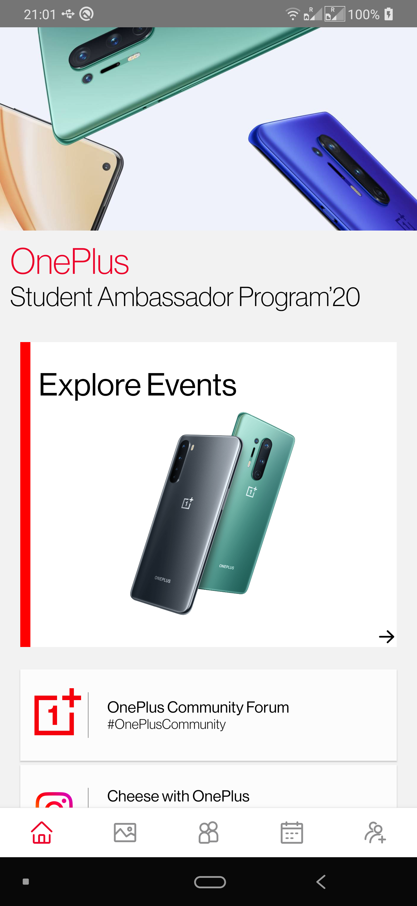
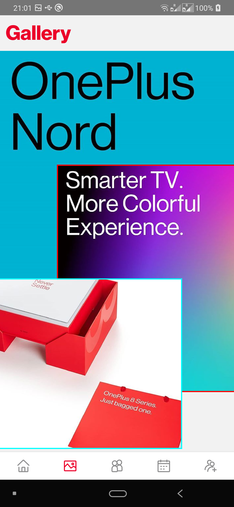
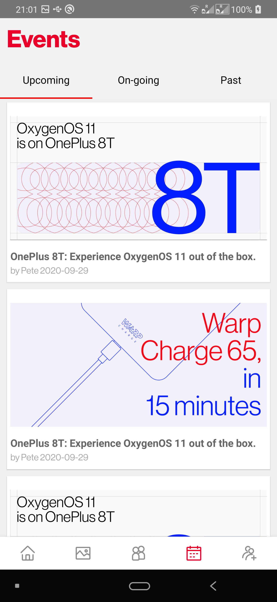
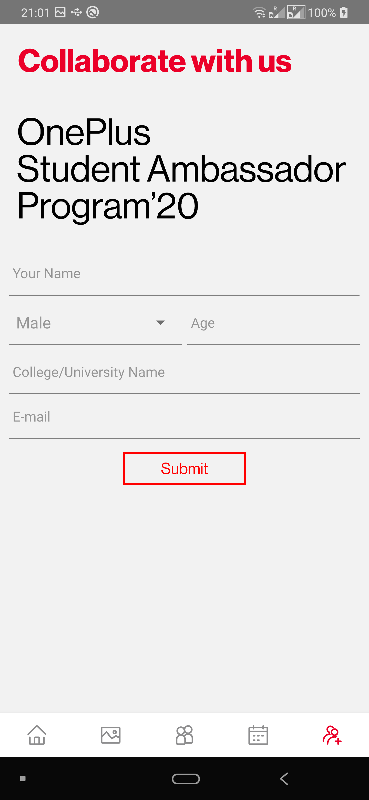

## OnePlus SAP'20 React Native Challenge

<div align="center">





</div>

> Compiled APK can be found in the releases tab.

### Pages

- Home
- Gallery
- Meet the Team
- Events
- Collab

### Deps

```
    "@react-native-community/masked-view": "^0.1.10",
    "@react-native-community/picker": "^1.8.0",
    "@react-navigation/bottom-tabs": "^5.9.1",
    "@react-navigation/native": "^5.7.5",
    "@react-navigation/stack": "^5.9.2",
    "react": "16.13.1",
    "react-native": "0.63.2",
    "react-native-gesture-handler": "^1.8.0",
    "react-native-image-slider-box": "^1.0.12",
    "react-native-reanimated": "^1.13.1",
    "react-native-safe-area-context": "^3.1.8",
    "react-native-screens": "^2.11.0",
    "react-native-splash-screen": "^3.2.0",
    "react-native-super-grid": "^4.0.3",
    "react-native-svg": "^12.1.0",
    "react-native-tab-view": "^2.15.1",
    "react-native-vector-icons": "^7.1.0"
```

**What not to expect?**

- Asset performance
- Tiny bit of inline-styling
- Form validation

---

A big thanks to SRMKZILLA Team and OnePlus OnePlus Student Ambassador Program'20
